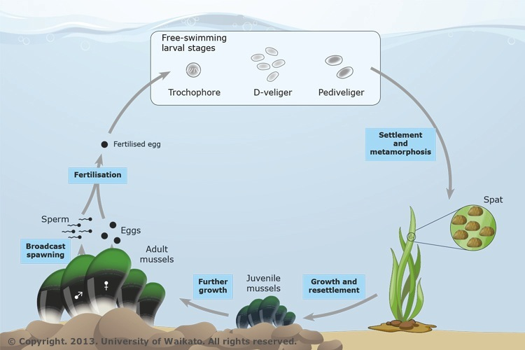

When you have completed the exercise below, submit your model and your lab write-up via the [Google Drive Form](https://docs.google.com/forms/d/e/1FAIpQLSdA2mkUojv-37gaK0ON-B8B2a7y5cxnMUJRhaqX747QtbMxhA/viewform?usp=header). Responses due by the following week's lab period.

During lab, we will work in groups. Here are the groups assigned for today's exercise:

* team 1
* team 2


## Overview
<p>For today's lab, we will create a model to simulate Hardy-Weinberg Equilibrium. Remember that HW Equilibrium means <i><u>no change in allele frequencies over time</i></u>. Your population can (probably should) start out of HW proportions but should attain them after one generation of random mating. This model will be the basis for models we build in the upcoming weeks. For example, next week we'll take this basic HW model and modify it to allow for genetic drift. You may wish to refer to the textbook or other resources to help you remember the meanings of equations, etc.</p>

<p>Open VensimPLE. It may be helpful to refer to last week's handout or your notes to help you remember where things are, etc.</p>


## Modeling Hardy-Weinberg Intro

<p>Before starting the model, think about what we are trying to do. What happens in the HW model? For an example, consider a population of mussels that reproduce by [broadcast spawning](https://youtu.be/SZ56PCWpB6o): once a year, individuals release their gametes into the water column, where they meet up with other gametes at random and undergo syngamy to form a new zygote (see figure).</p>

```{r, echo=FALSE, fig.cap="The life cycle of the New Zealand green-lipped mussel (<i>Perna canaliculus</i>, k&uuml;tai). As larvae, green-lipped mussels are free-swimming. They metamorphose and settle onto seaweed and subsequently onto solid surfaces.", out.extra='class="spaced-image"'}

```


<p>In nature, many mussels are iteroparous (spawning more than one reproductive episode in their lifetimes) but for the sake of our simple model, we're going to assume they are semelparous (they reproduce once and then die) Each individual in the population produces gametes (via meiosis), spews them out into the water column, and then dies (so we are modeling them as annuals, discrete non-overlapping generations). The gametes fuse into diploid zygotes (probabilistically, at random), spend some time as planktonic larva, and then settle on a hard surface where they grow into adult mussels. The next year, those adult mussels spew their gametes into the water and then die, etc (the circle of life...).</p>

<p>In our model, the number of Adults represents the total population size (<i>N</i>). It's the life stage that we are tracking from one generation to the next. We're also going to model the simplest base case, one locus with two alleles. We will have three genotypes, which is like having 3 different kinds of Adult mussels, each represented by a separate stock box. The mussels with each genotype will produce gametes (every individual produces the same number of gametes, no selection!). Those gametes will be joined at random (following binomial probabilities) to form the next generation of adults. For each generation, we will want to examine the observed genotype frequencies (based on the stocks), the allele frequencies (calculated from observed geno frequencies), and the HW expected genotype frequencies (calculated from allele frequencies).</p>

<p>When we create the new generation of mussels, we will do so following HW expectations, using the allele frequencies of gametes to determine how many zygotes of each genotype are formed. Note that we're going to assume the population size is not being affected and that it's large, we'll use N = 10000 for the total population in our example. And because we're examining HW, which occurs quickly, we'll use just 10 time steps (generations).</p>
</section>

		
## Building the Hardy-Weinberg Model


<p>For your reference, we're going to create 1 stock for each genotype. Each stock will have a flow to allow us to add new individuals in the next generaton. Each stock will also be set up to be Discrete, emptying out at the end of a time step (b/c all adults die after reproducing). We will also set up variables to keep track of total population size, observed genotype frequencies, allele frequencies, and expected genotype frequencies. Finally, we will want one graph to show geno- type frequencies and one to show allele frequencies. Below is an image of the completed model for you to reference.</p>

```{r, echo=FALSE, fig.cap="Image of the completed Hardy-Weinberg model.", out.extra='class="spaced-image"'}
knitr::include_graphics("../man/figures/hwmodel.png")
```

1. Open a new model and input the following settings:
<table>
  <tr>
  	<td>Units for Time</td>
  	<td>Year</td>
  	</tr>
  <tr>
    <td>INIITIAL TIME = </td>
    <td>0 </td>
  </tr>
  <tr>
    <td>FINAL TIME =</td>
    <td>10</td>
  </tr>
  <tr>
    <td>Time Step</td>
    <td>1</td>
  </tr>
</table><br>
2. First, set up your stocks for each genotype. Click the Stock icon and then click in the Build Window. Name the first one ‘genotypeA1A1' to denote that it will keep track of how many individuals have the genotype. A<sub>1</sub>A<sub>1</sub>. Now set up stocks for the other two genotypes. Like in the image, leave some space around each for you to add other components.
    * Remember that these boxes will contain a number of individuals of each genotype, not a frequency. 
    
3. Set up a flow into each stock, which you should name ‘deltaA1A1', ‘deltaA1A2', and ‘deltaA2A2'. Delta means change and these flows will calculate how many new zygotes there are of each genotype, each generation. Go ahead and make a single flow into each stock. Make sure the black arrow points into your stock, not away from it. 

4. To allow us to easily change the size of our population and figure out how many of each individual to start with, we'll create a Variable called 'inital N'. Click the Variable icon and then click in the Build Window to create this variable, name it 'initial N'. 

5. Create the rest of the variables in this list. You just need to place them in the model and name them for now. We'll finish set up when we enter equations. 
    * initial freq A1A1 -- this will set up the starting frequency of the A<sub>1</sub>A<sub>1</sub> genotype.
    * initial freq A1A2 -- this will set up the starting frequency of the A<sub>1</sub>A<sub>2</sub> genotype.
    * initial freq A2A2 -- this will set up the starting frequency of the A<sub>2</sub>A<sub>2</sub> genotype.
    * total N -- keeps track of population size for us
    * obs freq A1A1 -- the freq of A<sub>1</sub>A<sub>1</sub> in our population.
    * obs freq A1A2 -- the freq of A<sub>1</sub>A<sub>2</sub> in our population.
    * obs freq A2A2 -- the freq of A<sub>2</sub>A<sub>2</sub> in our population.
    * freqA1 -- frequency of the A1 allele in our population.
    * freqA2 -- frequency of the A2 allele in our population.
    * exp freq A1A1 -- the frequency of A<sub>1</sub>A<sub>1</sub> that we expect from HW given the allele frequencies.
    * exp freq A1A2 -- the frequency of A<sub>1</sub>A<sub>2</sub> that we expect from HW given the allele frequencies.
    * exp freq A2A2 -- the frequency of A<sub>2</sub>A<sub>2</sub> that we expect from HW given the allele frequencies.
	
6. Now that we have all our components set up, we can connect them with arrows. Use the image above as a guide for where to place your arrows. This list may also help:


<table style="width:90%">
  <tr>
  	<td style="width:15%"><b>Variable</td>
  	<td style="width:33%"><b>Arrow pointing to</td>
  	<td style="width:33%"><b>Arrow arriving from</td>
  	</tr>
  <tr>
    <td>genotypeA1A1 </td>
    <td>total N; obs freq A1A1; deltaA1A1 </td>
    <td>initial freq A1A1; initial N</td>
  </tr>
  <tr>
    <td>genotypeA1A2</td>
    <td>total N; obs freq A1A2; deltaA1A2</td>
    <td>initial freq A1A2; initial N</td>
  </tr>
  <tr>
    <td>genotype A2A2</td>
    <td>total N; obs freq A2A2; deltaA2A2</td>
    <td>initial freq A2A2; initial N</td>
  </tr>
  <tr>
  	<td>initial freq A1A1</td>
  	<td>genotypeA1A1</td>
  	<td>none</td>
  </tr>
  <tr>
  	<td>initial freq A1A2</td>
  	<td>genotypeA1A2</td>
  	<td>none</td>
  </tr>
  <tr>
  	<td>initial freq A2A2</td>
  	<td>genotypeA2A2</td>
  	<td>none</td>
  </tr>
  <tr>
  	<td>initial N</td>
  	<td>genotypeA1A1; genotypeA1A2; genotypeA2A2</td>
  	<td>none</td>
  </tr>
<tr>
  	<td>total N</td>
  	<td>obs freq A1A1; obs freq A1A2; obs freq A2A2; deltaA1A1; deltaA1A2; deltaA2A2</td>
  	<td>genotypeA1A1; genotypeA1A2; genotypeA2A2</td>
  </tr>
  <tr>
  	<td>obs freq A1A1</td>
  	<td>freqA1</td>
  	<td>genotypeA1A1; total N</td>
  </tr>
  <tr>
  	<td>obs freq A1A2</td>
  	<td>freqA1; freqA2</td>
  	<td>genotypeA1A2; total N</td>
  </tr>
  <tr>
  	<td>obs freq A2A2</td>
  	<td>freqA2</td>
  	<td>genotypeA2A2; total N</td>
  </tr>
  <tr>
  	<td>freq A1</td>
  	<td>exp freq A1A1; exp freq A1A2; exp freq A2A2; deltaA1A1; deltaA1A2; deltaA2A2</td>
  	<td>obs freq A1A1; obs freq A1A2</td>
  </tr>
  <tr>
  	<td>freq A2</td>
  	<td>none</td>
  	<td>obs freq A1A2; obs freq A2A2</td>
  </tr>
  <tr>
  	<td>exp freq A1A1</td>
  	<td>none</td>
  	<td>freqA1</td>
  </tr>
  <tr>
  	<td>exp freq A1A2</td>
  	<td>none</td>
  	<td>freqA1</td>
  </tr>
  <tr>
  	<td>exp freq A2A2</td>
  	<td>none</td>
  	<td>freqA1</td>
  </tr>
  <tr>
  	<td>deltaA1A1</td>
  	<td>none</td>
  	<td>freqA1; total N; genotypeA1A1</td>
  </tr>
  <tr>
  	<td>deltaA1A2</td>
  	<td>none</td>
  	<td>freqA1; total N; genotypeA1A2</td>
  </tr>
  <tr>
  	<td>deltaA2A2</td>
  	<td>none</td>
  	<td>freqA1; total N; genotypeA2A2</td>
  </tr>
</table><br>

7. Once we have our arrows placed, we are now in position to enter the equations for each variable. If we don't have the arrows correct, we won't be able to put the right equations in, so pay careful attention.

8. Remember, to enter equations, click on the Equations icon and then click on the variable whose info you want to edit. In the box that pops up, you enter the correct information for that variable. We have a lot of variables so let's take this slowly.

9. Let's start with the variables that we are just setting a value to initiate the model. For these, the equation is simple, it's just the starting value we are choosing to use. Use the following equations for these variables:

<table>
  <tr>
  	<td><b>Variable</td>
  	<td><b>Parameter</td>
  	<td><b>Value</td>
  	</tr>
<tr>
  	<td>initial N</td>
  	<td>Equations</td>
  	<td>10000</td>
  </tr>
  <tr>
  	<td>initial freq A1A1</td>
  	<td>Equations</td>
  	<td>0.4</td>
  </tr>
  <tr>
  	<td>initial freq A1A2</td>
  	<td>Equations</td>
  	<td>0.4</td>
  </tr>
  <tr>
  	<td>initial freq A2A2</td>
  	<td>Equations</td>
  	<td>0.2</td>
  </tr>
</table><br>
10. Next up, the 'total N' variable! You should be able to guess what the equation for this one will be... we want to know how many individuals of all genotypes are present so what should we add up? Discuss with your partner and enter your equation into the box for 'total N'. Click OK to save and close the popup box.

11. Having set up 'total N' and the initial variables, we can enter the initial values for the genotypes. We already entered a value for the frequency of each genotype so to get how many individuals of each are present, we just need to multiply the initial frequency by the total N value. 
    * Click on 'genotypeA1A1'. What should you enter for the initial value?
    * Make sure you do NOT change the equation entry for the genotypes, that is already set up correctly to be the value of the flow.
	
12. Now that we have the genotypes set up, we can put in the equations for each observed genotype frequency (obs freq A1A1, obs freq A1A2, obs freq A2A2). If we know how many individuals there are in the population and we know how many there are of genotype A1A1, what is the equation to get the observed genotype frequency?
    * Example: obs freq A1A1 equation = genotypeA1A1 / total N
    
13. And the observed genotype frequencies are used to get the freqA1 and freqA2, the allele frequencies! We can just sum up genotype frequencies. For A1, all of the A1A1 individuals and half of the A1A2 individuals carry A1 alleles so we get: 
    * freqA1 = obs freq A1A1 + 0.5 * obs freq A1A2
    * Go ahead and set the equation for freqA2 too!
	
14. Once we have the allele frequencies, we can figure out how many of each genotype we PREDICT from Hardy-Weinberg (compared to what was observed). So we can set up our expected genotype frequencies (exp freq A1A1, exp freq A1A2, exp freq A2A2). For these, we should use the HW model to predict the expected genotype frequencies so what equations do we use?
    * Example: exp freq A1A1 equation = p * p = freqA1 * freqA1
    * Set up the equations for A1A2 and A2A2 as well.
	
15. Finally, we are ready to put in equations for the delta values (deltaA1A1, deltaA1A2, deltaA2A2). These are our expectations given the allele frequencies and assuming Hardy-Weinberg conditions, but we also want to convert them into numbers not just frequencies AND we need to subtract the current value of that genotype stock so that we are just getting the change, not adding this value on top of the other one.
    * Example: deltaA1A1 = (freqA1 * freqA1 * total N) - genotypeA1A1
    * Go ahead and put in the equations for the other delta variables.
	
16. Once you have finished entering equations, check to make sure they are correct (you may want to use the key at the end). Then we are ready to click Simulate to run the model. To get a graph, hold down Shift while you click on the things you want to show on one graph (in this case, the 3 observed genotype frequencies) and then click Graph. 
    * What happened? Does anything change on the graphs? What did you expect to see? Consider your responses as you write up the lab exercise in the next section.

	
## Lab Write-Up
<p>To check our understanding of the HW model and what's going on, we should run the model under some different conditions and then evaluate what happens. Run the following scenarios of starting conditions and answer the questions below. Look at Lab 1 for instructions about using Simulation Control to test multiple conditions.

<table>
  <tr>
  	<td><b>Trial</td>
  	<td><b>initial freq A1A1</td>
  	<td><b>initial freq A1A2</td>
  	<td><b>initial freq A2A2</td>
  	</tr>
<tr>
  	<td>1</td>
  	<td>0.25</td>
  	<td>0.5</td>
  	<td>0.25</td>
  </tr>
  <tr>
  	<td>2</td>
  	<td>0.2</td>
  	<td>0.2</td>
  	<td>0.6</td>
  </tr>
  <tr>
  	<td>3</td>
  	<td>0</td>
  	<td>0.5</td>
  	<td>0.5</td>
  </tr>
  <tr>
  	<td>4</td>
  	<td>0.36</td>
  	<td>0.48</td>
  	<td>0.16</td>
  </tr>
</table><br>

### Questions

1. Which of the trials were already in Hardy-Weinberg proportions from the start of the run? How do you know?
2. Which of the trials maintained Hardy-Weinberg equilbrium over time? How do you know?
3. Did you expect the model to behave the way it did? Explain.
4. A younger friend of yours tells you that a population is only in Hardy-Weinberg when p = 0.5 and q = 0.5. How do you respond?
5. How did today's model building go for you? Was there anything of particular interest or frustration?

<p><b>Find your saved model file (should end in .mdl). Submit the model and your responses to the [Google Drive Form](https://docs.google.com/forms/d/e/1FAIpQLSdA2mkUojv-37gaK0ON-B8B2a7y5cxnMUJRhaqX747QtbMxhA/viewform?usp=header). Write-up are due by the next lab period.</b></p><br>


## Key to Equations
<p>Below find the table of equations for each variable.
<!--> <style type="text/css">
td
{
    padding:5px 8px 5px 10px;
    border: 1px solid black;
}
</style> <!--->
<table style="width:90%">
  <tr>
  	<td style="width:15%"><b>Variable</td>
  	<td style="width:10%"><b>Parameter</td>
  	<td style="width:60%"><b>Value of equations or initial</td>
  	</tr>
<tr>
  	<td>initial N</td>
  	<td>Equations</td>
  	<td>10000</td>
  </tr>
  <tr>
  	<td>initial freq A1A1</td>
  	<td>Equations</td>
  	<td>0.4</td>
  </tr>
  <tr>
  	<td>initial freq A1A2</td>
  	<td>Equations</td>
  	<td>0.4</td>
  </tr>
  <tr>
  	<td>initial freq A2A2</td>
  	<td>Equations</td>
  	<td>0.2</td>
  </tr>
  <tr>
    <td>genotypeA1A1 </td>
    <td>Initial </td>
    <td>initial freq A1A1 * initial N</td>
  </tr>
  <tr>
    <td>genotypeA1A2</td>
    <td>Initial</td>
    <td>initial freq A1A2 * initial N</td>
  </tr>
  <tr>
    <td>genotype A2A2</td>
    <td>Initial</td>
    <td>initial freq A2A2 * initial N</td>
  </tr>
  <tr>
  	<td>total N</td>
 	<td>Equations</td>
  	<td>genotypeA1A1 + genotypeA1A2 + genotypeA2A2</td>
  </tr>
  <tr>
  	<td>obs freq A1A1</td>
  	<td>Equations</td>
  	<td>genotypeA1A1 / total N</td>
  </tr>
  <tr>
  	<td>obs freq A1A2</td>
  	<td>Equations</td>
  	<td>genotypeA1A2 / total N</td>
  </tr>
  <tr>
  	<td>obs freq A2A2</td>
  	<td>Equations</td>
  	<td>genotypeA2A2 / total N</td>
  </tr>
  <tr>
  	<td>freq A1</td>
  	<td>Equations</td>
  	<td>obs freq A1A1 + 0.5 * obs freq A1A2</td>
  </tr>
  <tr>
  	<td>freq A2</td>
  	<td>Equations</td>
  	<td>obs freq A2A2 + 0.5 * obs freq A1A2</td>
  </tr>
  <tr>
  	<td>exp freq A1A1</td>
  	<td>Equations</td>
  	<td>freq A1 * freq A1</td>
  </tr>
  <tr>
  	<td>exp freq A1A2</td>
  	<td>Equations</td>
  	<td>2 * freq A1 * (1 - freq A1)</td>
  </tr>
  <tr>
  	<td>exp freq A2A2</td>
  	<td>Equations</td>
  	<td>(1 - freq A1) * (1 - freq A1)</td>
  </tr>
  <tr>
  	<td>deltaA1A1</td>
  	<td>Equations</td>
  	<td>(freq A1 * freq A1 * total N) - genotypeA1A1</td>
  </tr>
  <tr>
  	<td>deltaA1A2</td>
  	<td>Equations</td>
  	<td>(2 * freq A1 * (1 - freq A1) * total N) - genotypeA1A2</td>
  </tr>
  <tr>
  	<td>deltaA2A2</td>
  	<td>Equations</td>
  	<td>( (1 - freq A1) * (1 - freq A1) * total N) - genotypeA2A2</td>
  </tr>
</table></p><br>