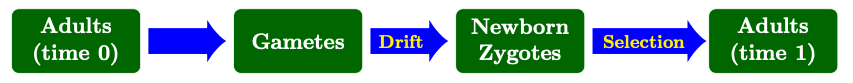
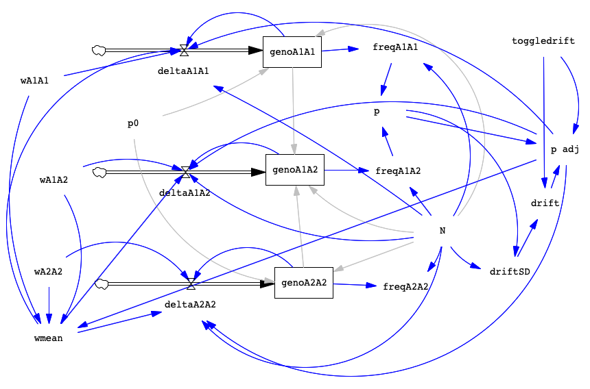

When you have completed the exercise below, submit your model and your lab write-up via the [Google Drive Form](https://forms.gle/E3QLACX1aA2Q6ist5). Responses due by the following week's lab period.

During lab, we will work in groups. Here are the groups assigned for today's exercise:

* Miles, Charlie, and Savannah
* Natalie and Paige
* Ella and Amanda
* Clara and Bethany
* Emmy and Jordyn
* Arc and Amy

---

## Overview {#overview}

Last week, we built a model incorporating genetic drift. This week, we'll incorporate selection too! To do this, we'll start with our drift model, saving it with a new name. Since our drift model included a toggle for drift, this will make it easy for us to run all possible combinations: drift only; selection only; both drift and selection.

Recall the order of events during the lifecycle of the organism. We added drift by adjusting the allele frequencies (the gene pool; we called the parameter "p adj") in the step where we formed newborn zygotes from gametes. We're going to apply selection in the next step: having determined which new zygotes are made, we apply selection to the survival of those zygotes to adulthood:

```{r, echo=FALSE, fig.alt="Image of the life cycle showing selection occurring during the maturation of juveniles into adults"}


```

Remember that selection occurs when genotypes differ (on average) in their survival and/or reproduction, that is, their <b>fitness</b>. At the moment, our model doesn't include fitness at all since we just assume everyone has the same survival and reproduction. So we are going to need to add relative fitness terms for each genotype. Once we have relative fitness terms, we can add those to our flow equations that determine how many new zygotes are created for each genotype each generation. We'll also have to adjust our values a little bit to make sure our population size stays constant since the average fitness of the population will now be less than 1 (due to genotypes having different fitnesses, some more and some less fit).

The equations for these parameters can look a little hairy so you may want to refer to your text (Ch. 8) or slides from class to remind you how things work.

For reference, here's an image of the completed model:

```{r, echo=FALSE, fig.alt="Image of the completed model with selection and drift"}


```

---

## Add Selection to the Drift Model {#add_selection}

Open your drift model from last week and save it as `selection.mdl`. You can now start from this model and build your new selection model.

For selection, we want to pair gametes randomly (for example, p × p in deltaA1A1, using HW) and then apply selection in the flows (deltaA1A1, deltaA1A2, deltaA2A2), representing our zygotes, so that the “adults” added to our stocks have already experienced selection.

As mentioned above, we need to add fitness values for each genotype and we need to add a term to calculate mean population fitness (wmean; for our correction to maintain total pop size). The last step will be adjusting our flows to make selection occur when creating zygotes.

### Genotype fitness and mean population fitness

In order to add fitness, we need to add 4 new variables, one for the fitness of each genotype and one to calculate population mean fitness (which helps keep constant our population size). Alternatively, we could add variables for the dominance coefficient and one for the selection coefficient but I think it's a little simpler for us to manipulate fitness values directly.

Create the following four variables and place arrows as indicated:

| Variable Name | Description | Arrow pointing to | Arrow arriving from |
| :--- | :--- | :--- | :--- |
| wA1A1 | fitness of genotype  | deltaA1A1; wmean | none |
| wA1A2 | fitness of genotype  | deltaA1A2; wmean | none |
| wA2A2 | fitness of genotype  | deltaA2A2; wmean | none |
| wmean | mean population fitness | deltaA1A1; deltaA1A2; deltaA2A2 | wA1A1; wA1A2; wA2A2; p adj |

Once we have arrows, we can set the equations for each variable. We will start off with all genotypes having the same fitness, as expected for the HW model and then we'll later be able to modify the fitness values with Simulation Control to see how the presence of selection changes the outcome. Click Equation and then adjust each fitness variable as indicated below.

| Variable Name | Equation | Min | Max | Incr |
| :--- | :--- | :--- | :--- | :--- |
| wA1A1 | 1 | 0 | 1 | 0.01 |
| wA1A2 | 1 | 0 | 1 | 0.01 |
| wA2A2 | 1 | 0 | 1 | 0.01 |

Once we have fitness values, we have to calculate the mean fitness of the population so we can adjust our population to stay at a constant size. For mean fitness of the population we'll use the variable named <b>wmean</b> (see below). Note that instead of using p in this equation, we are using p adj so that we can also include drift in our runs. Remember that when drift is OFF, then p adj = p. Set the equation for wmean to:

`wmean = (wA1A1*p adj*p adj) + (wA1A2*2*p adj*(1-p adj) ) + (wA2A2*(1-p adj)*(1-p adj) )`

Note that mean fitness of the population is NOT simply the average of the genotype fitnesses. Each genotype fitness is weighted by how common that genotype is in the population. If a low fitness genotype has very few individuals in our population, that will not have as much impact on the population as if they made up 1/3 of the individuals. If this feels confusing, review your text (p. 138-139) or talk to me!

### Adjusting flows

Now that we have fitness values, we need to add them to our flows so that selection occurs on newly formed zygotes. The equations below show the new values for our flows. Go ahead and click on each flow to update the graph (in each case, the first term is multiplied by genotype fitness and divided by mean fitness).

* `deltaA1A1 = (N * p adj * p adj * wA1A1 / wmean) - genoA1A1`
* `deltaA1A2 = (N * 2 * p adj * (1 - p adj) * wA1A2 / wmean) - genoA1A2`
* `deltaA2A2 = (N * (1 - p adj) * (1 - p adj) * wA2A2 / wmean) - genoA2A2`

What's happening here? In the new flows, we multiply the zygote frequency (p2, 2pq, or q2) by the fitness of the genotype (wA1A1, wA1A2, or wA2A2) and then divide by wmean. Thus, when a genotype's fitness value is equal to 1.0, that means it has the normal number of babies survive to adulthood, the maximum in our population. But when a genotype has a fitness less than 1.0, it will have fewer zygotes that survive to adulthood, compared to those with a higher value of fitness.

Last week, with the drift model, we were really only interested in thinking about p, the allele frequency. But since selection occurs on diploid individuals, this time we are interested in graphing what happens to the genotypes too. So, we'll want a graph for p and a separate one for freqA1A1, freqA1A2, and freqA2A2. But when we include drift and selection together, we'll graph p and just freqA1A2 (the graphs would get too crazy with all 3 genotypes!). Because selection is a deterministic process (for a given set of parameters the outcome is always the same), we don't need to run any given trial more than once -- if you did run it again it would be exactly the same.

### Check your model

Before we start trying out different outputs, let's make sure the model is behaving the way we expect it to. First, we'll just simulate no selection and no drift, which is the default setting we are using. For ease of use later, let's change a couple of the default settings. Click on Equation and then click on p0, change the value to 0.1 and click Ok. Then click on N and change the value to 500. Remember we started off our fitnesses as all equal to 1.0 so they will have the same fitness, there is no selection favoring any genotype or allele. And no drift is occurring (toggledrift=0).

Click Simulate and then select p, then click Graph. You should see that allele frequency starts at 0.1 and just stays there, no change. We are in HW equilibrium as expected if our model works. Similarly, if you select all 3 of the genotype frequencies, you should see that those values just remain constant across time.

Now, we need to run a trial where we expect selection occur. Let's use Simulation Control to do just that. Click on Simulation Control. Name this trial selection test and change the following parameters before clicking Save Changes and then Simulate:

| Variable | New Value | 
| :--- | :--- | 
| wA1A1 | 1 | 
| wA1A2 | 0.9 | 
| wA2A2 | 0.8 | 

The above conditions should favor the increase of the A1 allele (represented by p). Click on p and then click Graph. You should now see the line from your inital run and a new line representing this test run. Did it work as expected? If yes, go ahead with the next part. If not, figure out what's set up wrong! Feel free to ask Angie to help.

---

## Lab Write-Up {#assignment}

Ok, if everything went well for those 2 test runs, now it's time to familiarize ourselves with the effects of selection! Generally, when thinking about selection we are interested in how allele and genotype frequencies vary under different sets of genotype fitnesses and different starting allele frequencies. Note that, unlike drift, selection is not sensitive to population size, so we don't need to vary that when exploring selection alone. Make sure that you have toggledrift set to 0 (no drift) while just examining effects of selection. We'll see what selection + drift looks like later in the assignment.

To think about selection, we'll check out 6 sets of genotype fitnesses, as listed in the table below (don't run them yet, that's coming). Each set of fitness values corresponds to a particular type of selection and an inheritance pattern for the phenotype of fitness. Spend some time making sure you understand this table and try to predict what the equilibrium will be when you run the model with each set of fitnesses.

| Type of Selection | Highest fitness | Inheritance pattern | wA1A1 | wA1A2 | wA2A2  |
| :--- | :--- | :--- | :---: | :---: | :---: |
| None | None / All | NA | 1 | 1 | 1 |
| Directional |  |  dominant | 1 | 1 | 0.6 |
| Het. advantage |  | overdominance | 0.7 | 1 | 0.8 |
| Directional |  |  recessive | 1 | 0.95 | 0.95 |
| Directional |  | codominance | 1 | 0.9 | 0.8 |
| Het. disadvantage |  or  | underdominance | 0.9 | 0.7 | 1 |

Note that the fitness values imply a particular value of s, the selection coefficient. The value of s indicates the strength of selection (1 minus the fitness of the least fit homozygote) which tells us how quickly we can expect change to occur over time. A value s > 0.2 is usually considered very strong selection (compared to what we usually see in nature). A value of s < 0.05 is going to look fairly weak in the model—you will need to run the model for a longer period of time (more time steps) to reach equilibrium.

Now we'll start working through simulating different conditions. Each time, try to predict what will happen before you look at the results. In some cases, you may need to change the length of time the model runs to see equilibrium (change it in Model Settings). Remember to pay attention to starting conditions and keep a record of your graphs too. Use Simulation Control for your trials and name them in ways that you will know which is which. If your graphs get too messy (too many runs showing at once), you can click on Control Panel and move some of your trials to the left-hand list, then they won't show up on your graph but you can get them back if you need to.

### Questions

1. **Explore selection and inheritance patterns (No drift).** Run each of the scenarios in the table below. What patterns do you see? How does changing the fitness or the starting allele frequency alter the outcome? Remember to consider what equilibrium is reached, how long it takes to get there, and the shape of the curve (how fast things changed). Write up a paragraph summarizing your observations about how selection alters allele and genotype frequencies under different conditions. You should be making 2 graphs for each run, one of p and one of the genotype frequencies.

| Trial | Type | p0 | wA1A1 | wA1A2 | wA2A2 | N | Time | Drift |
| :--- | :--- | :---: | :---: | :---: | :---: | :--- | :--- | :--- |
| 1a | Directional | 0.9 | 0.7 | 1 | 1 | 500 | 200 | 0 |
| 1b | Het. advantage | 0.1 | 0.7 | 1 | 0.6 | 500 | 200 | 0 |
| 1c | Directional | 0.9 | 0.95 | 0.95 | 1 | 500 | 200 | 0 |
| 1d | Directional | 0.9 | 0.7 | 0.85 | 1 | 500 | 200 | 0 |
| 1e | Het. disadvantage | 0.3 | 0.9 | 0.7 | 1 | 500 | 200 | 0 |

2. **Effect of initial allele frequency.** Imagine that the environment changes and a population is now experiencing selection associated with genotype at the A-locus. We can envision selection occurring (1) for an allele that was already present in the population at an intermediate initial frequency OR (2) for a new mutation giving rise to a favorable allele, which then starts off at a very low initial frequency. How will this impact the outcome of selection? Run the following scenarios and describe the effect of initial allele frequency. You should change Final Time in Model Settings before you do these runs.

| Trial | Favored genotype | p0 | wA1A1 | wA1A2 | wA2A2 | N | Time | Drift |
| --- | --- | :---: | :---: | :---: | :---: | --- | --- | --- |
| 2a |  (common) | 0.35 | 1 | 0.95 | 0.9 | 500 | 250 | 0 |
| 2b |  (less common) | 0.1 | 1 | 0.95 | 0.9 | 500 | 250 | 0 |
| 2c |  (rare) | 0.01 | 1 | 0.95 | 0.9 | 500 | 250 | 0 |

3. **Examine the interaction of selection and drift occurring simultaneously.** Time to make things more interesting! Remember that selection occurs through differences in fitness while the effect of drift depends mainly on N. So, we'll need to vary both of these things to see how selection and drift interact. You might also recall that the effects of drift will generally be greater than selection when N<sub>e</sub>s < 1 (p. 149-150 in your text). Thus, we should look at what happens when we do and do not meet this criterion. (In our model N = N<sub>e</sub>.)<br><br>
For each of the parameter sets below, run the model 1 time without drift (toggledrift=0) and then 10 times with drift (toggledrift set to 1 through 10). For each of these trials, you should make 2 graphs, one of p with all 10 runs and one of freqA1A2 showing all 10 runs.
<style type="text/css">
td
{
    padding:5px 8px 0px 5px;
    border: 1px solid black;
}
</style>
<table>
  <tr>
  	<td><b>Description</td>
  	<td><b>Trial</td>
  	<td><b>N<sub>e</sub>s</td>
  	<td><b>wA1A1</td>
  	<td><b>wA1A2</td>
  	<td><b>wA2A2</td>
  	<td><b>p0</td>
  	<td><b>N</td>
  	<td><b>Final Time</td>
  	<td><b>toggledrift</td>
  </tr>
  <tr>
  	<th rowspan="3" style="border: 1px solid black">Rare favored allele, s=0.1</th>
  	<td>3a</td>
  	<td>100</td>
  	<td>1</td>
  	<td>0.95</td>
  	<td>0.9</td>
  	<td>0.01</td>
  	<td>1000</td>
  	<td>200</td>
  	<td>1 to 10</td>
  </tr>
  <tr>
  	<td>3b</td>
  	<td>10</td>
  	<td>1</td>
  	<td>0.95</td>
  	<td>0.9</td>
  	<td>0.01</td>
  	<td>100</td>
  	<td>200</td>
  	<td>1 to 10</td>
  </tr>
  <tr>
  	<td>3c</td>
  	<td>1</td>
  	<td>1</td>
  	<td>0.95</td>
  	<td>0.9</td>
  	<td>0.01</td>
  	<td>10</td>
  	<td>200</td>
  	<td>1 to 10</td>
  </tr>
  <tr>
  	<th rowspan="3" style="border: 1px solid black">Common favored allele, s=0.1</th>
  	<td>3d</td>
  	<td>100</td>
  	<td>1</td>
  	<td>0.95</td>
  	<td>0.9</td>
  	<td>0.5</td>
  	<td>1000</td>
  	<td>200</td>
  	<td>1 to 10</td>
  </tr>
  <tr>
  	<td>3e</td>
  	<td>10</td>
  	<td>1</td>
  	<td>0.95</td>
  	<td>0.9</td>
  	<td>0.5</td>
  	<td>100</td>
  	<td>200</td>
  	<td>1 to 10</td>
  </tr>
  <tr>
  	<td>3f</td>
  	<td>1</td>
  	<td>1</td>
  	<td>0.95</td>
  	<td>0.9</td>
  	<td>0.5</td>
  	<td>10</td>
  	<td>200</td>
  	<td>1 to 10</td>
  </tr>
  <tr>
  	<th rowspan="2" style="border: 1px solid black">Rare favored allele, s=0.4</th>
  	<td>3g</td>
  	<td>4</td>
  	<td>1</td>
  	<td>0.8</td>
  	<td>0.6</td>
  	<td>0.1</td>
  	<td>10</td>
  	<td>200</td>
  	<td>1 to 10</td>
  </tr>
  <tr>
  	<td>3h</td>
  	<td>40</td>
  	<td>1</td>
  	<td>0.8</td>
  	<td>0.6</td>
  	<td>0.1</td>
  	<td>100</td>
  	<td>200</td>
  	<td>1 to 10</td>
  </tr>
</table>
Note how often the selection equilibrium is achieved in comparison to extinction of the favored allele. Also pay attention to the time required to reach equilibrium and how jagged the lines are (how much allele frequency changes one generation to the next). For this question, you should present some graphs but you do not need to give me all of the graphs. Maybe choose which ones you think help demonstrate the patterns you are describing to me.<br><br>
**Write a summary of your observations of the interaction between drift and selection. What factors are most important in influencing the equilibrium outcome?**

4. **Reflection.** Has working with the model changed or deepened your understanding of these concepts? Do you have further questions about how things work or why?

**Submit your model and responses via the [Google Drive Form](https://forms.gle/E3QLACX1aA2Q6ist5). Write-ups are due by the next lab period.**

```