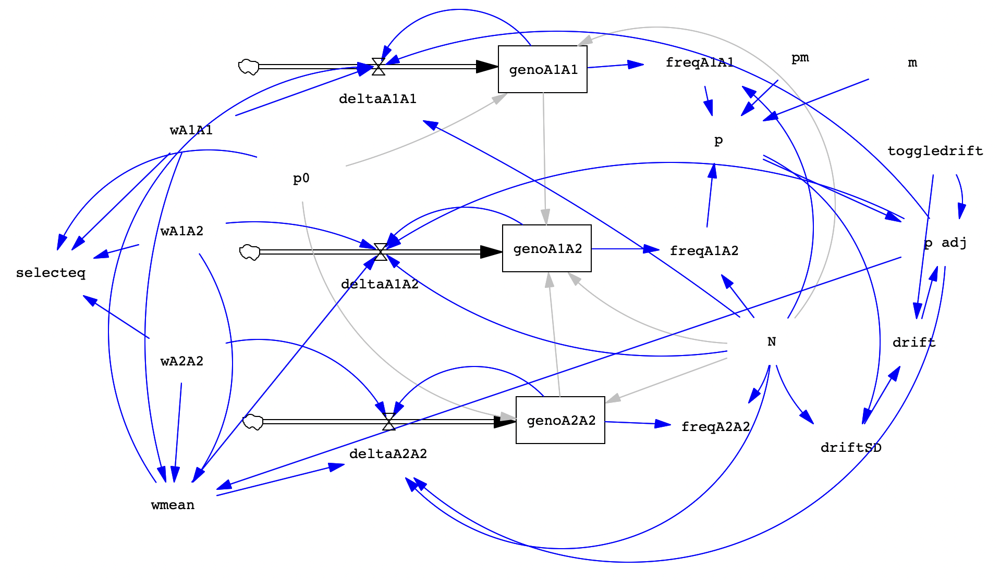

When you have completed the exercise below, submit your model and your lab write-up via the [Google Drive Form](https://forms.gle/E3QLACX1aA2Q6ist5). Responses due by the following week's lab period.

During lab, we will work in groups. Here are the groups assigned for today's exercise:

* Savannah and Natalie
* Charlie and Paige
* Ella and Arc
* Amanda and Clara
* Emmy and Amy
* Skylar and Bethany
* Miles and Jordyn

---

## Overview {#overview}

Today, we're ready to add gene flow to our model, alongside selection and drift. After completing today's model, we'll have a creation that allows us to investigate the effects of the three major forces of evolutionary change that we can observe on a human timescale! 

In the real world, we might often be thinking about gene flow occurring as individuals migrate from one sub-population into another. For simplicity, we'll focus on a single sub-population and consider how migration from a "continent" influences it. In this island-continent model, the continent allele frequency is our gene flow equilibrium.

We will adjust the allele frequency in our gametes before applying drift, and then selection will occur on the viability of zygotes (survival to maturity). We need to add two variables:

* **$p_m$**: the frequency of allele $A_1$ in the continent population (range 0-1).
* **$m$**: the rate of migration as a proportion (range 0-1).

The equation for allele frequency in the next generation is:
$p_{t+1} = (1 - m) \times p_t + m \times p_m$

Here's a reference image of the completed model:

```{r, echo=FALSE, fig.cap="Image of the completed model with selection, drift, and gene flow"}


```

---

## Add Gene Flow to the Model {#addflow}

Create the two variables  and , then set them up as follows:

| Variable | Description | Equation | Min | Max | Incr |
| --- | --- | --- | --- | --- | --- |
| **pm** | frequency of  allele in migrants | 0 | 0 | 1 | 0.001 |
| **m** | rate of migration | 0 | 0 | 1 | 0.001 |

Update the equation for **p** to include gene flow:
`p = (freqA1A1 + 0.5*freqA1A2) * (1-m) + pm*m`

### Predicted Selection Equilibrium

Create a variable called **selecteq** to display the predicted selection-only equilibrium. Set the equation as this specific IF-THEN-ELSE statement:

`IF THEN ELSE(wA1A1 = wA1A2 :AND: wA1A1 = wA2A2, p0, IF THEN ELSE((wA1A2 > wA1A1 :AND: wA1A2 > wA2A2) :OR: (wA1A2 < wA2A2 :AND: wA1A2 < wA1A1), (wA1A2 - wA2A2) / (2 * wA1A2 - wA1A1 - wA2A2), IF THEN ELSE(wA1A1 = 1, 1, 0)))`

---

## Test the model {#test}

Run these trials to ensure the "no evolution" state works correctly. All lines should be flat.

| N | p0 | toggledrift | wA1A1 | wA1A2 | wA2A2 | pm | m | Description |
| --- | --- | --- | --- | --- | --- | --- | --- | --- |
| 500 | 0.1 | 0 | 1 | 1 | 1 | 0 | 0 | No evolution |
| 500 | 0.1 | 0 | 1 | 1 | 1 | 1 | 0 | pm=1 but m=0 |

Now, test a run with active gene flow:

| N | p0 | toggledrift | wA1A1 | wA1A2 | wA2A2 | pm | m | Description |
| --- | --- | --- | --- | --- | --- | --- | --- | --- |
| 500 | 0.1 | 0 | 1 | 1 | 1 | 1 | 0.15 | 15% migration rate |

---

## Lab Write-Up {#submit}

### Questions

1. **Gene flow alone: Varying N, , and .** Run the conditions below. Address whether changing , , or  altered the equilibrium value of  or the time to reach it.

| Trial | N | p0 | toggledrift | wA1A1 | wA1A2 | wA2A2 | pm | m | Description |
| --- | --- | --- | --- | --- | --- | --- | --- | --- | --- |
| 1a | 500 | 0.1 | 0 | 1 | 1 | 1 | 0.6 | 0.15 | baseline |
| 1b | 50 | 0.1 | 0 | 1 | 1 | 1 | 0.6 | 0.15 | smaller N |
| 1c | 500 | 0.1 | 0 | 1 | 1 | 1 | 0.9 | 0.15 | higher pm |
| 1d | 500 | 0.1 | 0 | 1 | 1 | 1 | 0.3 | 0.15 | lower pm |
| 1e | 500 | 0.1 | 0 | 1 | 1 | 1 | 0.6 | 0.3 | higher m |
| 1f | 500 | 0.1 | 0 | 1 | 1 | 1 | 0.6 | 0.075 | lower m |
| 1g | 500 | 0.1 | 0 | 1 | 1 | 1 | 0.6 | 0.035 | lowest m |

2. **Drift and gene flow.** Observe the interaction below. Does gene flow prevent the fixation/extinction expected from drift?

| Trial | N | p0 | toggledrift | wA1A1 | wA1A2 | wA2A2 | pm | m |
| --- | --- | --- | --- | --- | --- | --- | --- | --- |
| 2a | 500 | 0.1 | 1-10 | 1 | 1 | 1 | 0.6 | 0 |
| 2b | 500 | 0.1 | 1-10 | 1 | 1 | 1 | 0.6 | 0.035 |
| 2c | 500 | 0.1 | 1-10 | 1 | 1 | 1 | 0.6 | 0.1 |
| 2d | 50 | 0.1 | 1-10 | 1 | 1 | 1 | 0.6 | 0 |
| 2e | 50 | 0.1 | 1-10 | 1 | 1 | 1 | 0.6 | 0.035 |
| 2f | 50 | 0.1 | 1-10 | 1 | 1 | 1 | 0.6 | 0.1 |

3. **Selection and gene flow.** Explore the interaction using a model of codominance ( favored).

| Trial | N | p0 | toggledrift | wA1A1 | wA1A2 | wA2A2 | pm | m | Description |
| --- | --- | --- | --- | --- | --- | --- | --- | --- | --- |
| 3a | 500 | 0.1 | 0 | 1 | 0.9 | 0.8 | 0.6 | 0 | no migration |
| 3b | 500 | 0.1 | 0 | 1 | 0.9 | 0.8 | 0.6 | 0.035 | low migration |
| 3c | 500 | 0.1 | 0 | 1 | 0.9 | 0.8 | 0.6 | 0.1 | high migration |
| 3d | 500 | 0.1 | 0 | 1 | 0.75 | 0.5 | 0.6 | 0.1 | high migration, s=0.5 |

4. **Selection, drift, and gene flow.** Combine all three forces. Does an allele ever achieve fixation or extinction in these runs?

| Trial | N | p0 | toggledrift | wA1A1 | wA1A2 | wA2A2 | pm | m | Description |
| --- | --- | --- | --- | --- | --- | --- | --- | --- | --- |
| 4a | 500 | 0.1 | 1-10 | 1 | 0.9 | 0.8 | 0.6 | 0.035 | N = 500 |
| 4b | 100 | 0.1 | 1-10 | 1 | 0.9 | 0.8 | 0.6 | 0.035 | N = 100 |
| 4c | 50 | 0.1 | 1-10 | 1 | 0.9 | 0.8 | 0.6 | 0.035 | N = 50 |
| 4d | 25 | 0.1 | 1-10 | 1 | 0.9 | 0.8 | 0.6 | 0.035 | N = 25 |

5. **Reflection.** Imagine a situation with multiple populations and gene flow in any direction. How might dynamics change? What are the takeaways for conservation?

**Remember to submit your model and responses via the [Google Drive Form](https://forms.gle/E3QLACX1aA2Q6ist5).**

```

```

