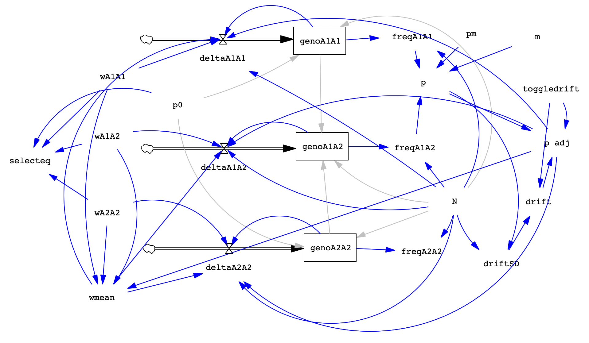

When you have completed the exercise below, submit your model and your lab write-up via the [Google Drive Form](https://forms.gle/E3QLACX1aA2Q6ist5). Responses due by the following week's lab period.

During lab, we will work in groups. Here are the groups assigned for today's exercise:

* Savannah and Natalie
* Charlie and Paige
* Ella and Arc
* Amanda, Clara, and Jordyn
* Emmy and Amy
* Miles and Bethany

---

## Overview {#overview}

Today, we're ready to add gene flow to our model, alongside selection and drift. After completing today's model, we'll have a creation that allows us to investigate the effects of the three major forces of evolutionary change that we can observe on a human timescale! And, we'll have set it up so we can allow for any combination of the three occurring at once (e.g., gene flow alone versus selection and drift). We have only just covered this chapter in class. So let me guide you through how to think about adding gene flow to our model.

In the real world, we might often be thinking about gene flow occurring as individuals migrate from one sub-population into another sub-population. However, we could also focus on a single sub-population of interest and only consider how migration is influencing allele and genotype frequencies in that single sub-population. For simplicity, that's what we'll do with our model today. There are also ways to create multiple instances of our basic model and enable the models to interact with each other but for now, we'll stick with the single sub-population. After all, this is how we think about the island-continent model of gene flow that we're working on today. In our case, the island is our population and the continent is where migrating individuals (or gametes) come from. In this particular model, gene flow is only coming from the continent to the island, so if only gene flow is occurring, we always predict that the island allele frequency will eventually be the same as that on the continent. Thus, the continent allele frequency is our gene flow equilibrium.

In order to add gene flow to our existing model, we'll presume that new alleles are added to the gene pool (read: the pool of gametes), either the production of gametes by newly arrived adults or via the movement of gametes themselves (such as pollen). To do this, we will adjust the allele frequency in our gametes, before applying drift to those allele frequencies. And then selection will still occur on the viability of zygotes (survival to maturity).

Assuming we're intending to model the island-continent version of gene flow, that means we have just 2 variables that need to be added to our current model:

* p<sub>m</sub>, the frequency of allele A<sub>1</sub> in the continent population (where our migrants are coming from; range 0-1).
* m, the rate of migration as a proportion; that is, the fraction of alleles in our sub-population coming from individuals not born in this sub-population (range 0-1).<br>

Given a starting allele frequency of p<sub>t</sub> in our sub-population, here's our equation for allele frequency in the next generation of our sub-population:

p<sub>t+1</sub> = (1−m) * p<sub>t</sub> + m * p<sub>m</sub>

That means we'll adjust the existing variable p, updating it's equation to match the one above. At present, our variable p is defined as, p = freqA1A1 + 0.5 ∗ freqA1A2. When we update this equation, we use the existing value (p) for p<sub>t</sub> in the equation including gene flow. Note that when m = 0, that will be the “no gene flow” scenario so that's how to turn gene flow ‘on' and ‘off '.

Here's a reference image of the completed model. Compared to last week, the only visible difference is the addition of those two components (m and p<sub>m</sub>) plus one extra, called selecteq which will be described below.

```{r, echo=FALSE, fig.alt="Image of the completed model with selection, drift, and gene flow"}


```

---

## Add Gene Flow to the Model {#addflow}

As described above, we need to add a rate of migration, m, and the frequency of allele A1 in the source population, p<sub>m</sub>, to our model. Both of these components will be variables we adjust the value of so we'll go ahead and specify a min, max, and increment in addition to a starting value. 

1. Create these two variables then click Equation and set them up.
<style type="text/css">
td
{
    padding:5px 8px 0px 10px;
    border: 1px solid black;
}
</style>
<table style="width:95%">
  <tr>
  	<td style="width:10%"><b>Variable</td>
  	<td style="width:50%"><b>Description</td>
  	<td><b>Equation</td>
  	<td><b>Min</td>
  	<td><b>Max</td>
  	<td><b>Incr</td>
  </tr>
  <tr>
  	<td>pm</td>
  	<td>frequency of A<sub>1</sub> allele in migrants</td>
  	<td>0</td>
  	<td>0</td>
  	<td>1</td>
  	<td>0.001</td>
  </tr>
  <tr>
  	<td>m</td>
  	<td>rate of migration, proportion of sub-pop alleles from individuals not born in the sub-pop</td>
  	<td>0</td>
  	<td>0</td>
  	<td>1</td>
  	<td>0.001</td>
  </tr>
</table><br>
Keep in mind that a value of m = 0.1 means that each generation 10% of the alleles in the population are from migrants. The actual number of migrant individuals arriving in the population will be the migration rate times the total population size (Nm).

2. Now, we need to use these variables in the rest of the model. Specifically, as described, we'll adjust the value of p using the equation from above. We'll multiply the existing value of p by (1 − m) and then add mp<sub>m</sub> to the whole thing. This means that in the life cycle of our organisms, we are allowing gene flow to happen prior to gamete production, then drift occurs to the gene pool, adjusting allele frequencies (yielding p adj), then zygotes are created (following HW) and their survival to maturity (viability) is adjusted by selection in the flows.<br><br>
Here's the equation for p in our gene flow model: (freqA1A1 + 0.5 * freqA1A2) * (1-m) + pm*m<br><br>
Since pm is our equilibrium allele frequency for gene flow, we can compare our actual allele frequency to see whether or not we reach equilibrium. Let's add one more Variable that will let us display the selection-only equilibrium too.

3. Create a variable called selecteq. This will take the settings we chose for fitness and determine what value of p we expect at equilibrium. To do that, we'll set the equation as an if-then statement, like we used in the drift model in Lab 3:<br><br>
IF THEN ELSE(wA1A1 = wA1A2 :AND: wA1A1 = wA2A2, p0, IF THEN ELSE((wA1A2 > wA1A1 :AND: wA1A2 > wA2A2) :OR: (wA1A2 < wA2A2 :AND: wA1A2 < wA1A1), (wA1A2 - wA2A2) / (2 * wA1A2 - wA1A1 - wA2A2), IF THEN ELSE(wA1A1 = 1, 1, 0)))<br><br>
This is a super complicated equation so be careful to enter it correctly. If you copy and paste it should be ok but please try to be sure you understand what the equation means...
    * In short, it says that IF all of the genotypes have the same fitness, THEN the equilibrium value will be whatever p is to begin with, p0. ELSE, if genotype fitnesses are not equal, THEN, IF A1A2 has the highest OR lowest fitness, THEN use the equation for heterozygote advantage to figure out the equilibrium. ELSE, IF one of the homozygotes has the highest fitness, THEN IF A1A1 has the highest fitness set equilibrium to p=1.0, ELSE set equilibrium to p=0 (because A2A2 has the highest fitness and will reach fixation).<br><br>

4. Now, when we are modeling gene flow, we'll want to graph p, pm, and selecteq so we can see how the actual outcome compares to the equilibrium we'd predict if only gene flow were happening (pm) or only selection were happening (selecteq).<br><br>
We're now ready to do a test run before using the model to understand gene flow and how it interacts with drift and selection.


## Test the model

5. Ok, let's do some runs to make sure that we haven't changed anything that alters the "no evolution" default state of the model AND that when we allow gene flow (but nothing else), we get the expected result.<br><br>
First let's run two trials that should give us flat lines (we stay in HW over time), just to make sure everything is working properly:<br>
<style type="text/css">
td
{
    padding:5px 8px 0px 5px;
    border: 1px solid black;
}
</style>
<table>
  <tr>
  	<td><b>N</td>
  	<td><b>p0</td>
  	<td><b>toggledrift</td>
  	<td><b>wA1A1</td>
  	<td><b>wA1A2</td>
  	<td><b>wA2A2</td>
  	<td><b>pm</td>
  	<td><b>m</td>
  	<td><b>Description</td>
  </tr>
  <tr>
  	<td>500</td>
  	<td>0.1</td>
  	<td>0</td>
  	<td>1</td>
  	<td>1</td>
  	<td>1</td>
  	<td>0</td>
  	<td>0</td>
  	<td>No evolution</td>
  </tr>
  <tr>
  	<td>500</td>
  	<td>0.1</td>
  	<td>0</td>
  	<td>1</td>
  	<td>1</td>
  	<td>1</td>
  	<td>1</td>
  	<td>0</td>
  	<td>pm=1 but m=0, still no evolution</td>
  </tr>
</table><br>
Go ahead and use Simulation Control to test these two runs. All lines should be flat. You should select the variables p adj, pm, and selecteq to graph. The pm line will be at y=0 when pm=0. And the selecteq line should be at y = p0 (0.1), which is also where the padj line will be (uncheck the boxes below the graphs to reveal overlapping lines). You can also open the Control Panel and choose which datasets are available on the right.<br><br>
Note that in addition to graphs, you can make tables that will show you the value of your variable(s) for each time step. To do that, select the variables you want to include (use Shift to select multiple) and then click on one of the table icons, below the graph icon. I like to use the 'Table Time Down' option. If you want to keep a table, you can save it as a text file if you click on File -> Save while you have the table selected. Or you can take a screenshot to keep the image. You can also copy and paste into a spreadsheet file and that will preserve the table grid (copy+paste into a text or word file will not keep the table grid).


6. Now, if that went ok we can start testing gene flow! Run the following parameter set but predict what will happen before you click Simulate and check the graph.<br>
<style type="text/css">
td
{
    padding:5px 8px 0px 5px;
    border: 1px solid black;
}
</style>
<table>
  <tr>
  	<td><b>N</td>
  	<td><b>p0</td>
  	<td><b>toggledrift</td>
  	<td><b>wA1A1</td>
  	<td><b>wA1A2</td>
  	<td><b>wA2A2</td>
  	<td><b>pm</td>
  	<td><b>m</td>
  	<td><b>Description</td>
  </tr>
  <tr>
  	<td>500</td>
  	<td>0.1</td>
  	<td>0</td>
  	<td>1</td>
  	<td>1</td>
  	<td>1</td>
  	<td>1</td>
  	<td>0.15</td>
  	<td>15% migration rate where all migrants are A1A1</td>
  </tr>
</table><br>
If you predicted the outcome correctly, great, proceed to work through the questions. If not, spend some time figuring out what's going on before you proceed - make sure you feel comfortable that you understand what to expect from gene flow.

## Lab Write-Up

Remember that the way we are representing gene flow, the values of pm and m do not change over time, so the expected equilibrium for gene flow (alone) will be that p adj = pm. Looking at the way in which we included gene flow in the model, you might guess that m, the rate of migration, will be important in determining how quickly we reach equilibrium. But you might also notice that none of the changes we made involve N, so equilibrium probably isn't going to depend on population size when only gene flow is occurring.<br><br>
When we investigate how gene flow interacts with selection and with drift, remember to identify which variables are the most important for determining equilibrium for each of those forces (fitness values and population size, respectively).<br><br>
For this lab exercise, we have two primary goals:
* Examine how gene flow alone changes allele and genotype frequencies (with no selection and no drift). Determine what factors have the most influence.
* Investigate the combined effects of gene flow and drift, gene flow and selection, and all three forces at once. Explore under what conditions gene flow alters the equilibrium outcome compared to when no gene flow was present.


### Questions

1. <b>Gene flow alone: Varying N, pm, and m.</b> Try to predict what effect you think changing each of these variables will have on the outcome. Consider the equilibrium value of p and time to equilibrium. Run the conditions in the table below and compare the outcomes. Address the following questions in a paragraph-form summary. You may include graphs to support your conclusions.
    * Varying N: Compare Trials 1a and 1b. Did changing population size matter?  
    * Varying pm: Compare Trials 1a, 1c, and 1d. Did changing pm matter?  
    * Varying m: Compare Trials 1a, 1e, 1f, and 1g. Did changing m matter?<br><br>
<style type="text/css">
td
{
    padding:5px 8px 0px 5px;
    border: 1px solid black;
}
</style>
<table>
  <tr>
  	<td><b>Trial</b></td>
  	<td><b>N</td>
  	<td><b>p0</td>
  	<td><b>toggledrift</td>
  	<td><b>wA1A1</td>
  	<td><b>wA1A2</td>
  	<td><b>wA2A2</td>
  	<td><b>pm</td>
  	<td><b>m</td>
  	<td><b>Description</td>
  </tr>
  <tr>
  	<td>1a</td>
  	<td>500</td>
  	<td>0.1</td>
  	<td>0</td>
  	<td>1</td>
  	<td>1</td>
  	<td>1</td>
  	<td>0.6</td>
  	<td>0.15</td>
  	<td>baseline, m = 0.15</td>
  </tr>
  <tr>
  	<td>1b</td>
  	<td>50</td>
  	<td>0.1</td>
  	<td>0</td>
  	<td>1</td>
  	<td>1</td>
  	<td>1</td>
  	<td>0.6</td>
  	<td>0.15</td>
  	<td>N = 50, smaller N</td>
  </tr>
  <tr>
  	<td>1c</td>
  	<td>500</td>
  	<td>0.1</td>
  	<td>0</td>
  	<td>1</td>
  	<td>1</td>
  	<td>1</td>
  	<td>0.9</td>
  	<td>0.15</td>
  	<td>pm = 0.9, higher pm</td>
  </tr>
  <tr>
  	<td>1d</td>
  	<td>500</td>
  	<td>0.1</td>
  	<td>0</td>
  	<td>1</td>
  	<td>1</td>
  	<td>1</td>
  	<td>0.3</td>
  	<td>0.15</td>
  	<td>pm = 0.3, lower pm</td>
  </tr>
  <tr>
  	<td>1e</td>
  	<td>500</td>
  	<td>0.1</td>
  	<td>0</td>
  	<td>1</td>
  	<td>1</td>
  	<td>1</td>
  	<td>0.6</td>
  	<td>0.3</td>
  	<td>m = 0.3, higher m</td>
  </tr>
  <tr>
  	<td>1f</td>
  	<td>500</td>
  	<td>0.1</td>
  	<td>0</td>
  	<td>1</td>
  	<td>1</td>
  	<td>1</td>
  	<td>0.6</td>
  	<td>0.075</td>
  	<td>m = 0.075, lower m</td>
  </tr>
  <tr>
  	<td>1g</td>
  	<td>500</td>
  	<td>0.1</td>
  	<td>0</td>
  	<td>1</td>
  	<td>1</td>
  	<td>1</td>
  	<td>0.6</td>
  	<td>0.035</td>
  	<td>m = 0.035, lower m</td>
  </tr>
</table><br>

2. <b>Drift and gene flow.</b> Keep in mind what you observed with only gene flow. Remember that for genetic drift, N is a crucial factor. Also, having very low allele frequencies leads to a higher probability of extinction so we'll consider what happens when an allele is rare in residents but common in immigrants. Remember drift will only influence our sub-population, not the source population of migrants; pm will be constant. Note that you will have to keep track of how many times you run each set of conditions. <b>After observing the trials below, write a summary of the interaction between drift and gene flow.</b> Does the presence of both forces prevent the equilibria you'd expect from only one of them acting? What does this illustrate for us about how genetic variation can be maintained in natural populations?<br>
<style type="text/css">
td
{
    padding:5px 8px 0px 5px;
    border: 1px solid black;
}
</style>
<table>
  <tr>
  	<td><b>Trial</b></td>
  	<td><b>N</td>
  	<td><b>p0</td>
  	<td><b>toggledrift (# runs)</td>
  	<td><b>wA1A1</td>
  	<td><b>wA1A2</td>
  	<td><b>wA2A2</td>
  	<td><b>pm</td>
  	<td><b>m</td>
  	<td><b>Description</td>
  </tr>
  <tr>
  	<td>2a</td>
  	<td>500</td>
  	<td>0.1</td>
  	<td>1-10</td>
  	<td>1</td>
  	<td>1</td>
  	<td>1</td>
  	<td>0.6</td>
  	<td>0</td>
  	<td>no migration, large N</td>
  </tr>
  <tr>
  	<td>2b</td>
  	<td>500</td>
  	<td>0.1</td>
  	<td>1-10</td>
  	<td>1</td>
  	<td>1</td>
  	<td>1</td>
  	<td>0.6</td>
  	<td>0.035</td>
  	<td>low migration, large N</td>
  </tr>
  <tr>
  	<td>2c</td>
  	<td>500</td>
  	<td>0.1</td>
  	<td>1-10</td>
  	<td>1</td>
  	<td>1</td>
  	<td>1</td>
  	<td>0.6</td>
  	<td>0.1</td>
  	<td>high migration, large N</td>
  </tr>
  <tr>
  	<td>2d</td>
  	<td>50</td>
  	<td>0.1</td>
  	<td>1-10</td>
  	<td>1</td>
  	<td>1</td>
  	<td>1</td>
  	<td>0.6</td>
  	<td>0</td>
  	<td>no migration, small N</td>
  </tr>
  <tr>
  	<td>2e</td>
  	<td>50</td>
  	<td>0.1</td>
  	<td>1-10</td>
  	<td>1</td>
  	<td>1</td>
  	<td>1</td>
  	<td>0.6</td>
  	<td>0.035</td>
  	<td>low migration, small N</td>
  </tr>
  <tr>
  	<td>2f</td>
  	<td>50</td>
  	<td>0.1</td>
  	<td>1-10</td>
  	<td>1</td>
  	<td>1</td>
  	<td>1</td>
  	<td>0.6</td>
  	<td>0.1</td>
  	<td>high migration, small N</td>
  </tr>
</table><br>

3. <b>Selection and gene flow.</b> Now let's look at the outcome when both selection and gene flow are occuring in our sub-population (but no drift allowed). For selection, we remember that the difference in fitness between genotypes is important to determining the equilibrium and that the starting allele frequency and dominance coefficient influence how quickly we get to equilibrium. Right now, let's just focus on varying selection strength and the rate of migration to explore the intersection. We'll use a model of codominance of A1 and A2 (h = 0.5), with the A1A1 individual having the highest fitness. <b>Complete the trials below and compare outcomes. Write a summary of the interaction between selection and gene flow.</b><br>
<style type="text/css">
td
{
    padding:5px 8px 0px 5px;
    border: 1px solid black;
}
</style>
<table>
  <tr>
  	<td><b>Trial</b></td>
  	<td><b>N</td>
  	<td><b>p0</td>
  	<td><b>toggledrift (# runs)</td>
  	<td><b>wA1A1</td>
  	<td><b>wA1A2</td>
  	<td><b>wA2A2</td>
  	<td><b>pm</td>
  	<td><b>m</td>
  	<td><b>Description</td>
  </tr>
  <tr>
  	<td>3a</td>
  	<td>500</td>
  	<td>0.1</td>
  	<td>0</td>
  	<td>1</td>
  	<td>0.9</td>
  	<td>0.8</td>
  	<td>0.6</td>
  	<td>0</td>
  	<td>no migration, s = 0.2</td>
  </tr>
  <tr>
  	<td>3b</td>
  	<td>500</td>
  	<td>0.1</td>
  	<td>0</td>
  	<td>1</td>
  	<td>0.9</td>
  	<td>0.8</td>
  	<td>0.6</td>
  	<td>0.035</td>
  	<td>low migration, s = 0.2</td>
  </tr>
  <tr>
  	<td>3c</td>
  	<td>500</td>
  	<td>0.1</td>
  	<td>0</td>
  	<td>1</td>
  	<td>0.9</td>
  	<td>0.8</td>
  	<td>0.6</td>
  	<td>0.1</td>
  	<td>high migration, s = 0.2</td>
  </tr>
  <tr>
  	<td>3d</td>
  	<td>500</td>
  	<td>0.1</td>
  	<td>0</td>
  	<td>1</td>
  	<td>0.75</td>
  	<td>0.5</td>
  	<td>0.6</td>
  	<td>0.1</td>
  	<td>high migration, s = 0.5</td>
  </tr>
</table><br>
4. <b>Selection, drift, and gene flow</b> Now we put all three forces together! Since we just explored the intersection of selection and gene flow, we'll use some of those conditions and vary N to get a sense of how adding drift changes things. Run the following conditions, turning on drift and running 10 times each. Observe whether drift changes the outcome. Normally, we expect drift to lead to fixation or extinction of our A1 allele, at equilibrium. Does one allele ever achieve fixation or extinction in these runs? <b>Summarize your observations on what happens to allele frequencies when all three evolutionary forces are acting simultaneously. Be sure to comment on whether equilibrium is reached and how it differs from forces acting alone. How do you think these simulations relate to the patterns we observe when we sample populations in nature?</b><br>
<style type="text/css">
td
{
    padding:5px 8px 0px 5px;
    border: 1px solid black;
}
</style>
<table>
  <tr>
  	<td><b>Trial</b></td>
  	<td><b>N</td>
  	<td><b>p0</td>
  	<td><b>toggledrift (# runs)</td>
  	<td><b>wA1A1</td>
  	<td><b>wA1A2</td>
  	<td><b>wA2A2</td>
  	<td><b>pm</td>
  	<td><b>m</td>
  	<td><b>Description</td>
  </tr>
  <tr>
  	<td>4a</td>
  	<td>500</td>
  	<td>0.1</td>
  	<td>1-10</td>
  	<td>1</td>
  	<td>0.9</td>
  	<td>0.8</td>
  	<td>0.6</td>
  	<td>0.035</td>
  	<td>N = 500</td>
  </tr>
  <tr>
  	<td>4b</td>
  	<td>100</td>
  	<td>0.1</td>
  	<td>1-10</td>
  	<td>1</td>
  	<td>0.9</td>
  	<td>0.8</td>
  	<td>0.6</td>
  	<td>0.035</td>
  	<td>N = 100</td>
  </tr>
  <tr>
  	<td>4c</td>
  	<td>50</td>
  	<td>0.1</td>
  	<td>1-10</td>
  	<td>1</td>
  	<td>0.9</td>
  	<td>0.8</td>
  	<td>0.6</td>
  	<td>0.035</td>
  	<td>N = 50</td>
  </tr>
  <tr>
  	<td>4d</td>
  	<td>25</td>
  	<td>0.1</td>
  	<td>1-10</td>
  	<td>1</td>
  	<td>0.9</td>
  	<td>0.8</td>
  	<td>0.6</td>
  	<td>0.035</td>
  	<td>N = 25</td>
  </tr>
</table><br>

5. <b>Reflect back on this lab exercise.</b> In this exercise, we considered just one population and did not allow for variation over time in migration rate, population size, or selection strength. Imagine that we generalized these results to a situation with multiple populations and gene flow in any direction. How do you think the dynamics of allele frequency changes might be similar or different? What do you think are the takeaways that we should keep in mind when approaching conservation issues?<br><br>


**Remember to submit your model and responses via the [Google Drive Form](https://forms.gle/E3QLACX1aA2Q6ist5).**

```

```

